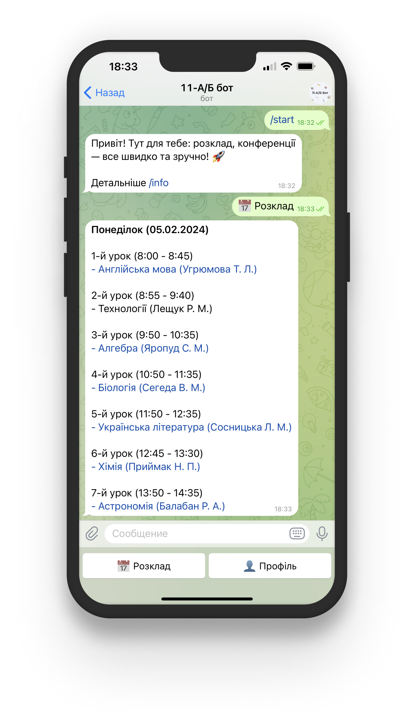
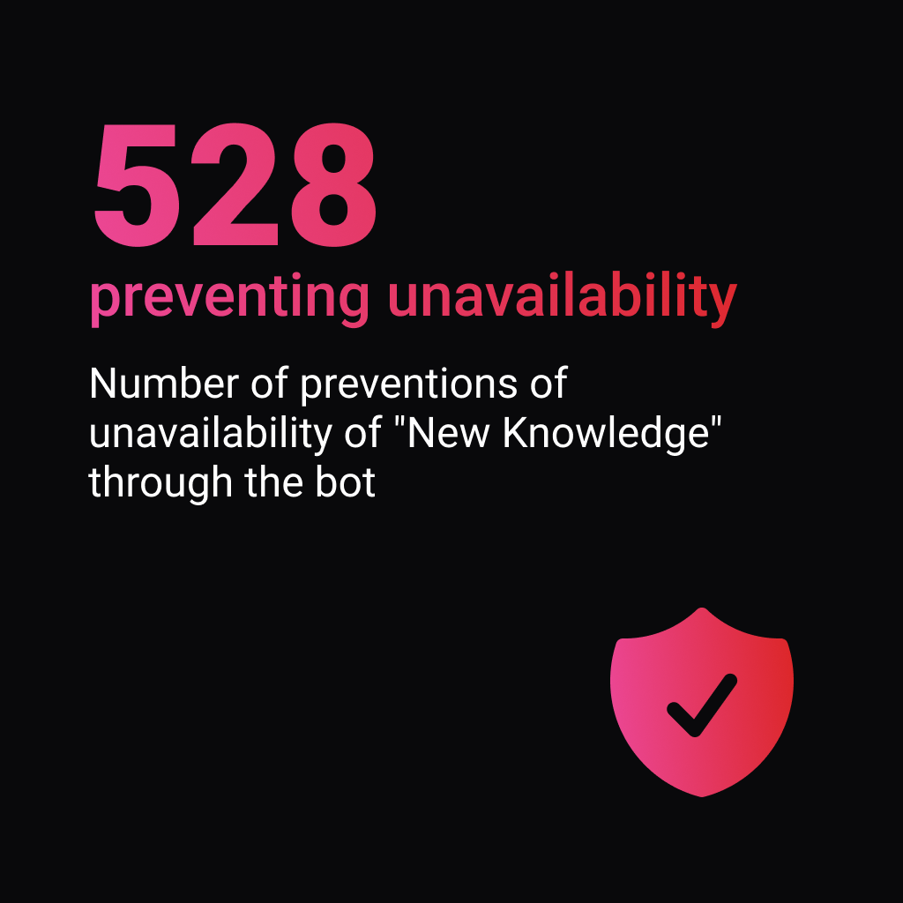
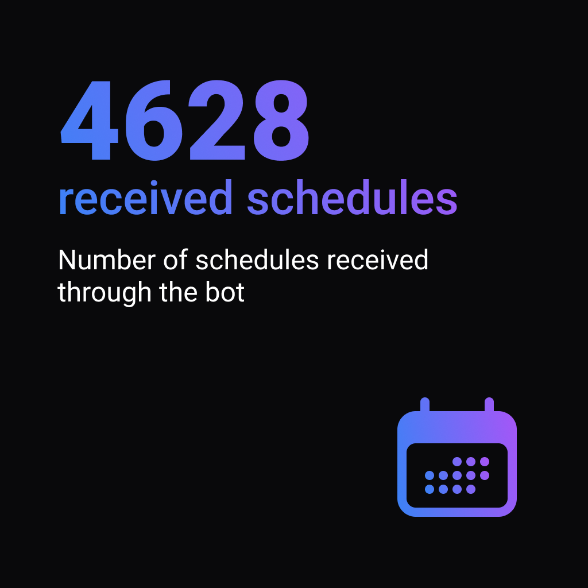

# Telegram bot for Vinnytsia Lyceum No. 34 🤖

This bot is designed for eleventh-grade students to prevent inconveniences and frequent problems with the unavailability of the electronic journal "New Knowledge."

<div style="display: flex; align-items: flex-start;">
    <div style="flex: 1;">
        <h3>Main functions of the bot:</h3>
        <ul>
            <li><strong>Quick and convenient access to the schedule</strong>: Instant access to the current schedule of classes.</li>
            <li><strong>One-click connection to online lessons</strong>: Ability to join online lessons directly from the schedule.</li>
            <li><strong>Instant notifications of schedule changes</strong>: Prompt notification of any changes to the schedule.</li>
            <li><strong>Daily lesson schedule at 7:30</strong>: Automatic sending of the daily lesson schedule every day at 7:30 in the morning.</li>
        </ul>
        <p>This bot provides convenient and reliable access to the schedule, helping students efficiently plan their study day and promptly respond to changes.</p>
    </div>
    <div style="flex: 1;">
        
    </div>
</div>

## Installation

### Prerequisites

To run this bot, you need to have Docker installed. You can download Docker from the [official website](https://www.docker.com/get-started).

### Instructions

1. **Clone the repository**:

   ```bash
   git clone https://github.com/yevheniikulisidi/vl34-11-bot.git
   cd vl34-11-bot
   ```

2. **Install dependencies**:

   ```bash
   npm install
   ```

3. **Configure the environment**:
   - Copy the `.env.example` file to `.env`:
   ```bash
   cp .env.example .env
   ```
   - Fill in the environment variables in the `.env` file (note that without student credentials, the bot will not be able to function properly).

## Usage

1. **Run Docker containers in detached mode**:

   ```bash
   docker-compose up -d
   ```

2. **Run in development mode**:

   ```bash
   npm run start
   ```

3. **Run in watch mode**:

   ```bash
   npm run start:dev
   ```

4. **Run in production mode**:
   ```bash
   npm run start:prod
   ```

After completing these steps, the bot will be ready to work and respond to commands from users.

## Statistics

The bot has been running since **2024** and has been in operation for more than **5** months.

### Photos

<table>
  <tr>
    <td align="center"></td>
    <td align="center"></td>
  </tr>
  <tr>
    <td align="center"></td>
    <td align="center"></td>
  </tr>
</table>
